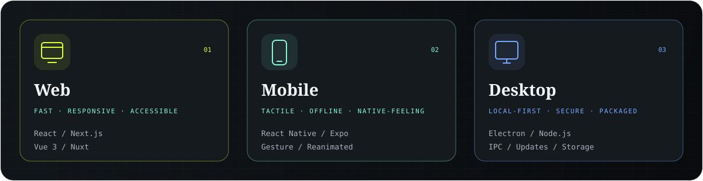
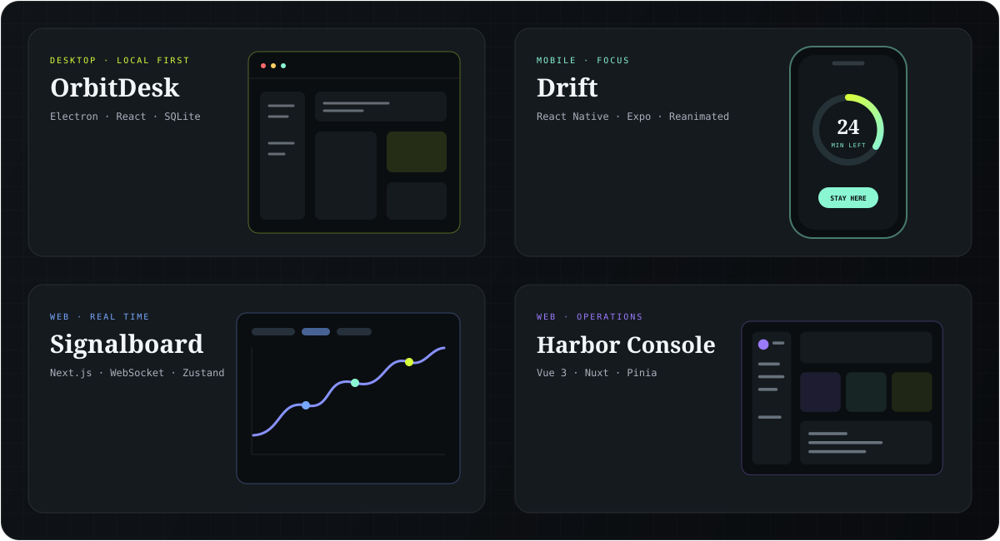

  

  <strong>Frontend engineer building polished products across every screen.</strong>

  You may know me as <a href="https://github.com/xubaoer19940428">@xubaoer19940428</a>. I used that account for eight years before it was banned—this is my new home on GitHub. ☹️

  

 

 

## Selected product concepts

  Product architecture · design systems · motion · performance · accessibility · i18n

  <b>Make it clear. Make it fast. Make it feel native.</b>

