  

  <strong>Nine years across screens, runtimes, and product surfaces.</strong>
   
  Previously <code>@xubaoer19940428</code> · rebuilding my open-source home here.

  <code>WEB</code>&nbsp;&nbsp;·&nbsp;&nbsp;<code>MOBILE</code>&nbsp;&nbsp;·&nbsp;&nbsp;<code>DESKTOP</code>&nbsp;&nbsp;·&nbsp;&nbsp;<code>WECHAT</code>

## Technology map

  
<strong>Readable stack overview</strong>

   

| Surface | Technologies | Engineering focus |
| :-- | :-- | :-- |
| **Web** | React, Next.js, Vue, Nuxt, TypeScript | SPA, SSR, responsive UI, component systems |
| **Mobile** | React Native, uni-app | Cross-platform UI, native integration, gestures, device adaptation |
| **Desktop** | Electron, React, Vue, Node.js | IPC, file system, local storage, packaging and updates |
| **WeChat** | Mini Programs, Official Accounts, H5, JS-SDK | Platform APIs, bridge integration, multi-end state flows |

## Engineering core

  Architecture · Design systems · Motion · Performance · Accessibility · i18n · Release engineering

  <b>One product mindset. Every screen.</b>

<!-- Profile metadata checkpoint. -->
